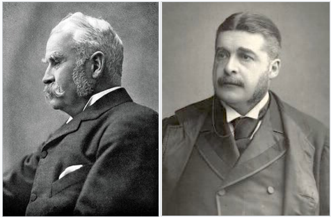

**************************************************
Gilbert & Sullivan
**************************************************

Gilbert and Sullivan was a Victorian-era theatrical partnership of the dramatist W. S. Gilbert and the composer Arthur Sullivan, who jointly created fourteen comic operas between 1871 and 1896, of which H.M.S. Pinafore, The Pirates of Penzance and The Mikado are among the best known.

Gilbert, who wrote the libretti for these operas, created fanciful "topsy-turvy" worlds where each absurdity is taken to its logical conclusion; fairies rub elbows with British lords, flirting is a capital offense, gondoliers ascend to the monarchy, and pirates emerge as noblemen who have gone astray. Sullivan, six years Gilbert's junior, composed the music, contributing memorable melodies that could convey both humor and pathos.

.. toctree::
	:maxdepth: 1

	pirates-penzance/0-index.rst
	pinafore.rst
	sorcerer.rst
	thespis.rst
	utopia-limited.rst
	yeomen-guard.rst

