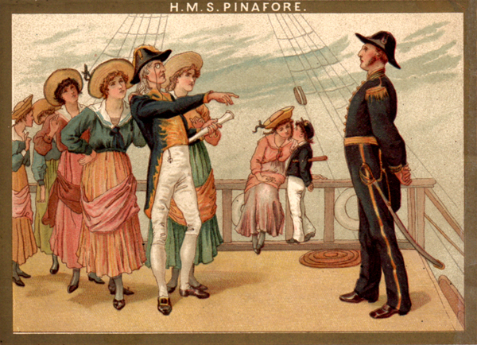

**************************************************
Pinafore
**************************************************

H.M.S. Pinafore; or, The Lass That Loved a Sailor is a comic opera in two acts, with music by Arthur Sullivan and a libretto by W. S. Gilbert. It opened at the Opera Comique in London, on 25 May 1878 and ran for 571 performances, which was the second-longest run of any musical theatre piece up to that time. H.M.S. Pinafore was Gilbert and Sullivan's fourth operatic collaboration and their first international sensation.

The story takes place aboard the Royal Navy ship HMS Pinafore. The captain's daughter, Josephine, is in love with a lower-class sailor, Ralph Rackstraw, although her father intends her to marry Sir Joseph Porter, the First Lord of the Admiralty. She abides by her father's wishes at first, but Sir Joseph's advocacy of the equality of humankind encourages Ralph and Josephine to overturn conventional social order. They declare their love for each other and eventually plan to elope. The Captain discovers this plan, but, as in many of the Gilbert and Sullivan operas, a surprise disclosure changes things dramatically near the end of the story.

Drawing on several of his earlier "Bab Ballad" poems, Gilbert imbued this plot with mirth and silliness. The opera's humour focuses on love between members of different social classes and lampoons the British class system in general. Pinafore also pokes good-natured fun at patriotism, party politics, the Royal Navy, and the rise of unqualified people to positions of authority. The title of the piece comically applies the name of a garment for girls and women, a pinafore, to the fearsome symbol of a warship.

Pinafore's extraordinary popularity in Britain, America and elsewhere was followed by the similar success of a series of Gilbert and Sullivan works, including The Pirates of Penzance and The Mikado. Their works, later known as the Savoy operas, dominated the musical stage on both sides of the Atlantic for more than a decade and continue to be performed today. The structure and style of these operas, particularly Pinafore, were much copied and contributed significantly to the development of modern musical theatre.

