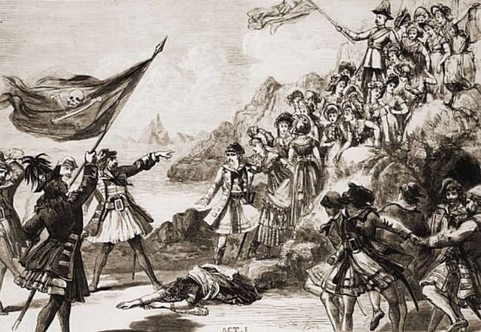

**************************************************
The Pirates of Penzance
**************************************************

	

The Pirates of Penzance; or, The Slave of Duty is a comic opera in two acts, with music by Arthur Sullivan and libretto by W. S. Gilbert. Its official premiere was at the Fifth Avenue Theatre in New York City on 31 December 1879, where it was well received by both audiences and critics. Its London debut was on 3 April 1880, at the Opera Comique, where it ran for 363 performances.

.. toctree::
   :maxdepth: 1

   1-background.rst
   2-genesis.rst
   3-synopsis.rst
   4-reception.rst

