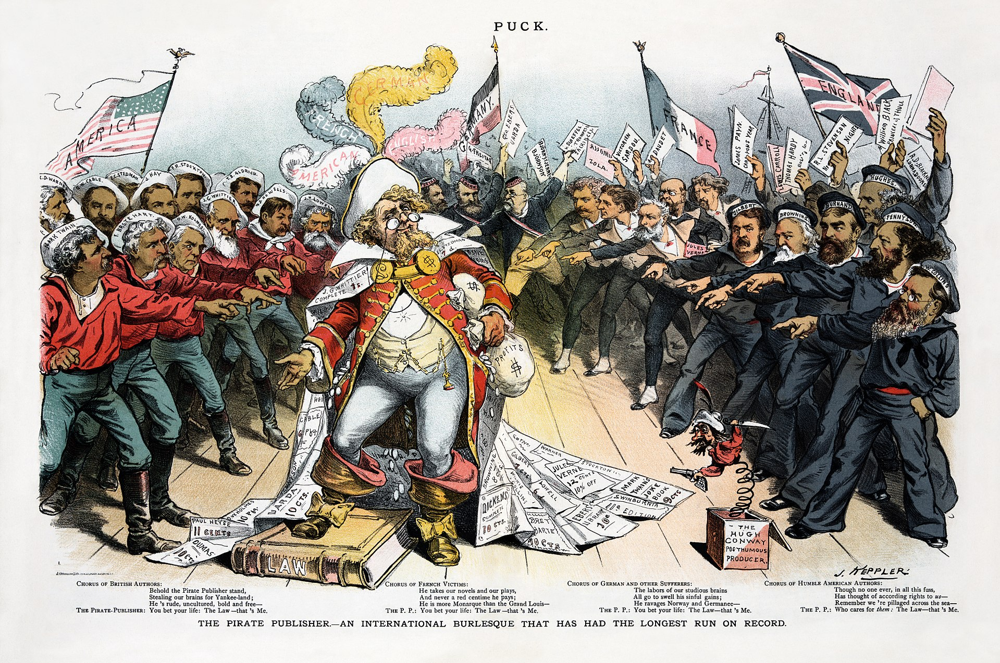

**************************************************
Background
**************************************************

The Pirates of Penzance was the only Gilbert and Sullivan opera to have its official premiere in the United States. At the time, American law offered no copyright protection to foreigners. After the pair's previous opera, H.M.S. Pinafore, achieved success in London in 1878, approximately 150 American companies quickly mounted unauthorised productions that often took considerable liberties with the text and paid no royalties to the creators. Gilbert and Sullivan hoped to forestall further "copyright piracy" by mounting the first production of their next opera in America, before others could copy it, and by delaying publication of the score and libretto. They succeeded in keeping for themselves the direct profits of the first American production of The Pirates of Penzance by opening the production themselves on Broadway, prior to the London production, and they also operated profitable US touring companies of Pirates and Pinafore. However, Gilbert, Sullivan, and their producer, Richard D'Oyly Carte, failed in their efforts, over the next decade, to control the American performance copyrights to Pirates and their other operas.

Fiction and plays about pirates were ubiquitous in the 19th century. Walter Scott's The Pirate (1822) and James Fenimore Cooper's The Red Rover were key sources for the romanticised, dashing pirate image and the idea of repentant pirates. Both Gilbert and Sullivan had parodied these ideas early in their careers. Sullivan had written a comic opera called The Contrabandista, in 1867, about a hapless British tourist who is captured by bandits and forced to become their chief. Gilbert had written several comic works that involved pirates or bandits. In Gilbert's 1876 opera Princess Toto, the title character is eager to be captured by a brigand chief. Gilbert had translated Jacques Offenbach's operetta Les brigands, in 1871. As in Les brigands, The Pirates of Penzance absurdly treats stealing as a professional career path, with apprentices and tools of the trade such as the crowbar and life preserver.

