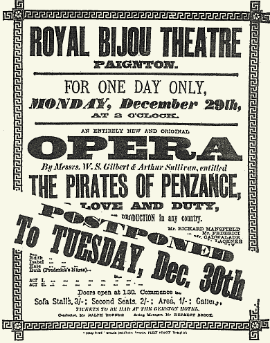

**************************************************
Genesis
**************************************************

While Pinafore was running strongly at the Opera Comique in London, Gilbert was eager to get started on his and Sullivan's next opera, and he began working on the libretto in December 1878. He re-used several elements of his 1870 one-act piece, Our Island Home, which had introduced a pirate "chief", Captain Bang. Bang was mistakenly apprenticed to a pirate band as a child by his deaf nursemaid. Also, Bang, like Frederic in The Pirates of Penzance, had never seen a woman before and felt a keen sense of duty, as an apprenticed pirate, until the passage of his twenty-first birthday freed him from his articles of indenture. Bernard Shaw believed that Gilbert drew on ideas in Les brigands for his new libretto, including the businesslike bandits and the bumbling police. Gilbert and Sullivan also inserted into Act II an idea they first considered for a one-act opera parody in 1876 about burglars meeting police, while their conflict escapes the notice of the oblivious father of a large family of girls. As in Pinafore, "there was a wordful self-descriptive set-piece for Stanley he ["Major-General's Song"], introducing himself much as Sir Joseph Porter had done ... a lugubrious comic number for the Sergeant of Police ... a song of confession for Ruth, the successor  Little Buttercup", romantic material for Frederic and Mabel, and "ensemble and chorus music in turn pretty, parodic and atmospheric."

Gilbert, Sullivan and Carte met by 24 April 1879 to make plans for a production of Pinafore and the new opera in America. Carte travelled to New York in the summer of 1879 and made arrangements with theatre manager John T. Ford to present, at the Fifth Avenue Theatre, the authorised productions. He then returned to London. Meanwhile, once Pinafore became a hit in London, the author, composer and producer had the financial resources to produce future shows themselves, and they executed a plan to free themselves from their financial backers in the "Comedy Opera Company". Carte formed a new partnership with Gilbert and Sullivan to divide profits equally among themselves after the expenses of each of their shows.

In November 1879, Gilbert, Sullivan and Carte sailed to America with a company of singing actors, to play both Pinafore and the new opera, including J. H. Ryley as Sir Joseph, Blanche Roosevelt as Josephine, Alice Barnett as Little Buttercup, Furneaux Cook as Dick Deadeye, Hugh Talbot as Ralph Rackstraw and Jessie Bond as Cousin Hebe, some of whom had been in the Pinafore cast in London. To these, he added some American singers, including Signor Brocolini as Captain Corcoran. Alfred Cellier came to assist Sullivan, while his brother François Cellier remained in London to conduct Pinafore there. Gilbert and Sullivan cast talented actors who were not well-known stars and did not command high fees. They then tailored their operas to the particular abilities of these performers. The skill with which Gilbert and Sullivan used their performers had an effect on the audience: as critic Herman Klein wrote, "we secretly marvelled at the naturalness and ease with which [the Gilbertian quips and absurdities] were said and done. For until then no living soul had seen upon the stage such weird, eccentric, yet intensely human beings ....  [They] conjured into existence a hitherto unknown comic world of sheer delight." Gilbert acted as stage director for his own plays and operas. He sought naturalism in acting, which was unusual at the time, just as he strove for realistic visual elements. He deprecated self-conscious interaction with the audience and insisted on a style of portrayal in which the characters were never aware of their own absurdity but were coherent internal wholes. Sullivan conducted the music rehearsals.

Sullivan had sketched out the music for Pirates in England. When he arrived in New York, however, he found that he had left the sketches for Act I behind, and he had to reconstruct the first act from memory, or compose new numbers. Gilbert told a correspondent many years later that Sullivan was unable to recall his setting of the entrance of the women's chorus, so they substituted the chorus "Climbing over rocky mountain" from their earlier opera, Thespis. Sullivan's manuscript for Pirates contains pages removed from a Thespis score, with the vocal parts of this chorus altered from their original arrangement as a four-part chorus. Some scholars (e.g. Tillett and Spencer, 2000) have suggested that Gilbert and Sullivan had planned all along to re-use "Climbing over rocky mountain," and perhaps other parts of Thespis. They argue that Sullivan's having brought the unpublished Thespis score to New York, when there were no plans to revive Thespis, might not have been accidental. In any case, on 10 December 1879, Sullivan wrote a letter to his mother about the new opera, upon which he was hard at work in New York. "I think it will be a great success, for it is exquisitely funny, and the music is strikingly tuneful and catching." As was his usual practice in his operas, Sullivan left the overture for the last moment, often sketching it out and entrusting completion of "the details" to an assistant, in this case the company's music director, Alfred Cellier.

Pinafore opened in New York on 1 December 1879 and ran for the rest of December. After a reasonably strong first week, audiences quickly fell off, since most New Yorkers had already seen local productions of Pinafore. In the meantime, Gilbert and Sullivan raced to complete and rehearse The Pirates of Penzance. The work's title is a multi-layered joke. On the one hand, Penzance was a docile seaside resort in 1879, and not the place where one would expect to encounter pirates. On the other hand, the title was also a jab at the theatrical "pirates" who had staged unlicensed productions of H.M.S. Pinafore in America. To secure the British copyright, a D'Oyly Carte touring company gave a perfunctory copyright performance of Pirates the afternoon before the New York premiere, at the Royal Bijou Theatre in Paignton, Devon, organised by Helen Lenoir, who would later marry Richard D'Oyly Carte. The cast, which was performing Pinafore in the evenings in Torquay, received some of the music for Pirates only two days beforehand. Having had only one rehearsal, they travelled to nearby Paignton for the matinee, where they read their parts from scripts carried onto the stage, making do with whatever costumes they had on hand. 

