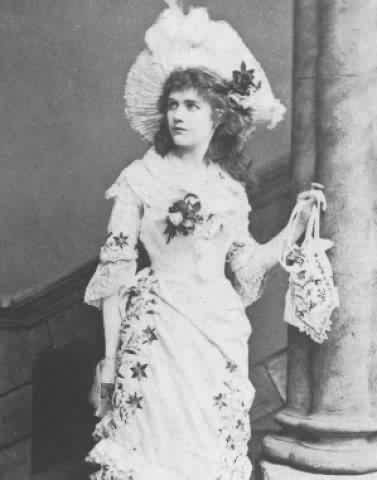
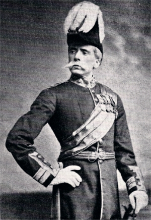
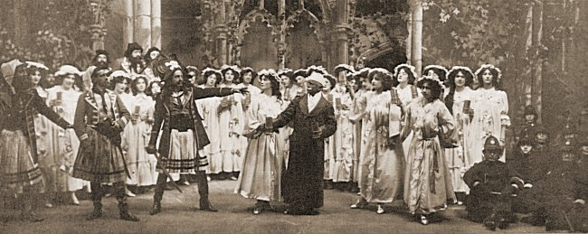

**************************************************
Synopsis
**************************************************

The story concerns Frederic, who, having completed his 21st year, is released from his apprenticeship to a band of tender-hearted pirates. He meets the daughters of Major-General Stanley, including Mabel, and the two young people fall instantly in love. Frederic soon learns, however, that he was born on the 29th of February, and so, technically, he has a birthday only once each leap year. His indenture specifies that he remain apprenticed to the pirates until his "twenty-first birthday", meaning that he must serve for another 63 years. Bound by his own sense of duty, Frederic's only solace is that Mabel agrees to wait for him faithfully. 

Act I
==================================================

On the coast of Cornwall, during Queen Victoria's reign, Frederic celebrates the completion of his twenty-first year and the end of his apprenticeship to a gentlemanly band of pirates ("Pour, oh pour the pirate sherry"). The pirates' maid of all work, Ruth, appears and reveals that, as Frederic's nursemaid long ago, she made a mistake "through being hard of hearing": Mishearing Frederic's father's instructions, she apprenticed him to a pirate, instead of to a ship's pilot ("When Frederic was a little lad").

Frederic has never seen any woman other than Ruth, and he believes her to be beautiful. The pirates know better and suggest that Frederic take Ruth with him when he returns to civilisation. Frederic announces that, although it pains him, so strong is his sense of duty that, once free from his apprenticeship, he will be forced to devote himself to the pirates' extermination. He also points out that they are not successful pirates: since they are all orphans, they allow their prey to go free if they too are orphans. Frederic notes that word of this has got about, so captured ships' companies routinely claim to be orphans. Frederic invites the pirates to give up piracy and go with him, so that he need not destroy them, but the Pirate King says that, contrasted with respectability, piracy is comparatively honest ("Oh! better far to live and die"). The pirates depart, leaving Frederic and Ruth. Frederic sees a group of beautiful young girls approaching the pirate lair, and realises that Ruth misled him about her appearance ("Oh false one! You have deceived me!"). Sending Ruth away, Frederic hides before the girls arrive.
George Power, the original Frederic in London

The girls burst exuberantly upon the secluded spot ("Climbing over rocky mountain"). Frederic reveals himself ("Stop, ladies, pray!"), startling them. He appeals to them to help him reform ("Oh! is there not one maiden breast?"). The girls are fascinated by him, but all reject him, except one: Mabel responds to his plea, chiding her sisters for their lack of charity ("Oh sisters deaf to pity's name for shame!"). She offers Frederic her pity ("Poor wand'ring one"), and the two quickly fall in love. The other girls discuss whether to eavesdrop or to leave the new couple alone ("What ought we to do?"), deciding to "talk about the weather," although they steal glances at the affectionate couple ("How beautifully blue the sky").

Frederic warns the young ladies that his old associates will soon return ("Stay, we must not lose our senses"), but before they can flee, the pirates arrive and capture the girls, intending to marry them ("Here's a first rate opportunity"). Mabel warns the pirates that the girls' father is a Major-General ("Hold, monsters!"), who soon arrives and introduces himself ("I am the very model of a modern Major-General"). He appeals to the pirates not to take his daughters, leaving him to face his old age alone. Having heard of the famous Pirates of Penzance, he pretends that he is an orphan to elicit their sympathy ("Oh, men of dark and dismal fate"). The soft-hearted pirates release the girls ("Hail, Poetry!"), making Major-General Stanley and his daughters honorary members of their band ("Pray observe the magnanimity").

Act II
==================================================

The Major-General sits in a ruined chapel on his estate, surrounded by his daughters. His conscience is tortured by the lie that he told the pirates, and the girls attempt to console him ("Oh dry the glist'ning tear"). The Sergeant of Police and his corps arrive to announce their readiness to arrest the pirates ("When the foeman bares his steel"). The girls loudly express their admiration of the police for facing likely slaughter by fierce and merciless foes. The police are unnerved by this and leave reluctantly.

Left alone, Frederic, who is to lead the police, reflects on his opportunity to atone for a life of piracy ("Now for the pirates' lair"), at which point he encounters Ruth and the Pirate King. They have realised that Frederic's apprenticeship was worded so as to bind him to them until his twenty-first birthday – and, because that birthday happens to be on the 29th of February (in a leap year), it means that technically only five birthdays have passed ("When you had left our pirate fold"), and he will not reach his twenty-first birthday until he is in his eighties. Frederic is convinced by this logic and agrees to rejoin the pirates. He then sees it as his duty to inform the Pirate King of the Major-General's deception. The outraged outlaw declares that the pirates' "revenge will be swift and terrible" ("Away, away, my heart's on fire").

Frederic meets Mabel ("All is prepared"), and she pleads with him to stay ("Stay Frederic, stay"), but he feels bound by his duty to the pirates until his 21st birthday – in 1940. They agree to be faithful to each other until then, though to Mabel "It seems so long" ("Oh, here is love, and here is truth"); Frederic departs. Mabel steels herself ("No, I'll be brave") and tells the police that they must go alone to face the pirates. They muse that an outlaw might be just like any other man, and it is a shame to deprive him of "that liberty which is so dear to all" ("When a felon's not engaged in his employment"). The police hide on hearing the approach of the pirates ("A rollicking band of pirates we"), who have stolen onto the estate, intending to take revenge for the Major-General's lie ("With cat-like tread").

Just then, Major-General Stanley appears, sleepless with guilt, and the pirates also hide ("Hush, hush! not a word"), while the Major-General listens to the soothing breeze ("Sighing softly to the river"). The girls come looking for him. The pirates leap out to seize them, and the Pirate King urges the captured Major-General to prepare for death. The police rush to their defence but are easily defeated. The Sergeant has one stratagem left: he demands that the pirates yield "in Queen Victoria's name"; the pirates, overcome with loyalty to their Queen, do so. Ruth appears and reveals that the pirates are "all noblemen who have gone wrong". The Major-General is impressed by this and all is forgiven. Frederic and Mabel are reunited, and the Major-General is happy to marry his daughters to the noble ex-pirates after all ("Poor Wand'ring Ones" (reprise)).

