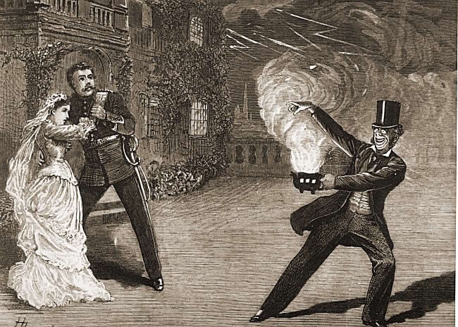

**************************************************
The Sorcerer
**************************************************

The Sorcerer is a two-act comic opera, with a libretto by W. S. Gilbert and music by Arthur Sullivan. It was the British duo's third operatic collaboration. The plot of The Sorcerer is based on a Christmas story, An Elixir of Love, that Gilbert wrote for The Graphic magazine in 1876. A young man, Alexis, is obsessed with the idea of love leveling all ranks and social distinctions. To promote his beliefs, he invites the proprietor of J. W. Wells & Co., Family Sorcerers, to brew a love potion. This causes everyone in the village to fall in love with the first person they see and results in the pairing of comically mismatched couples. In the end, Wells must sacrifice his life to break the spell.

The opera opened on 17 November 1877 at the Opera Comique in London, where it ran for 178 performances. It was considered a success by the standards of that time and encouraged the collaborators to write their next opera, H.M.S. Pinafore. The Sorcerer was revised for an 1884 revival, and that version is usually performed today. The Sorcerer was the first Savoy opera for which the author and composer had nearly total control over the production and the selection of cast. Several of the actors chosen went on to create principal roles in most of the later Gilbert and Sullivan operas. It was their first opera to use all the major character types and typical range of songs that would appear in their later collaborations, such as comic duets, a patter song, a contrapuntal double chorus, a tenor and soprano love duet, a soprano showpiece and so forth.

The modest success of The Sorcerer was overshadowed by the extraordinary popularity of Gilbert and Sullivan's later collaborations, and the opera remains one of the team's less popular ones. The satire in the piece concerns Victorian-era class distinctions and operatic conventions with which modern audiences are less familiar. Nevertheless, the opera was important to the development of the Gilbert and Sullivan collaboration and is still regularly played.

