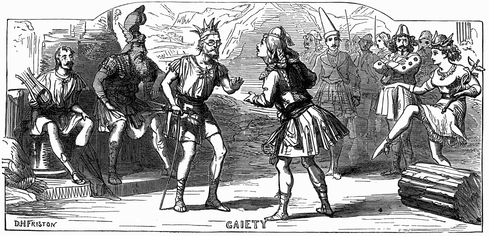

**************************************************
Thespis
**************************************************

In 1871, producer John Hollingshead brought Gilbert and Sullivan together to produce a Christmas entertainment, Thespis, at his Gaiety Theatre, a large West End house. The piece was an extravaganza in which the classical Greek gods, grown elderly, are temporarily replaced by a troupe of 19th-century actors and actresses, one of whom is the eponymous Thespis, the Greek father of the drama. Its mixture of political satire and grand opera parody mimicked Offenbach's Orpheus in the Underworld and La belle Hélène, which (in translation) then dominated the English musical stage.

Thespis opened on Boxing Day and ran for 63 performances. It outran five of its nine competitors for the 1871 holiday season, and its run was extended beyond the length of a normal run at the Gaiety, but no one at the time foresaw that this was the beginning of a great collaboration. Unlike the later Gilbert and Sullivan works, it was hastily prepared, and its nature was more risqué, like Gilbert's earlier burlesques, with a broader style of comedy that allowed for improvisation by the actors. Two of the male characters were played by women, whose shapely legs were put on display in a fashion that Gilbert later condemned. The musical score to Thespis was never published and is now lost, except for one song that was published separately, a chorus that was re-used in The Pirates of Penzance, and the Act II ballet music.

Over the next three years, Gilbert and Sullivan did not have occasion to work together again, but each man became more eminent in his field. Gilbert worked with Frederic Clay on Happy Arcadia (1872) and Alfred Cellier on Topsyturveydom (1874) and wrote The Wicked World (1873), Sweethearts (1874) and several other libretti, farces, extravaganzas, fairy comedies, dramas and adaptations. Sullivan completed his Festival Te Deum (1872); another oratorio, The Light of the World (1873); his only song cycle, The Window; or, The Song of the Wrens (1871); incidental music to The Merry Wives of Windsor (1874); and more songs, parlour ballads, and hymns, including "Onward, Christian Soldiers" (1872). At the same time, the audience for theatre was growing because of the rapidly expanding British population; improvement in education and the standard of living, especially of the middle class; improving public transport; and installation of street lighting, which made travel home from the theatre safer. The number of pianos manufactured in England doubled between 1870 and 1890 as more people began to play parlour music at home and more theatres and concert halls opened.

