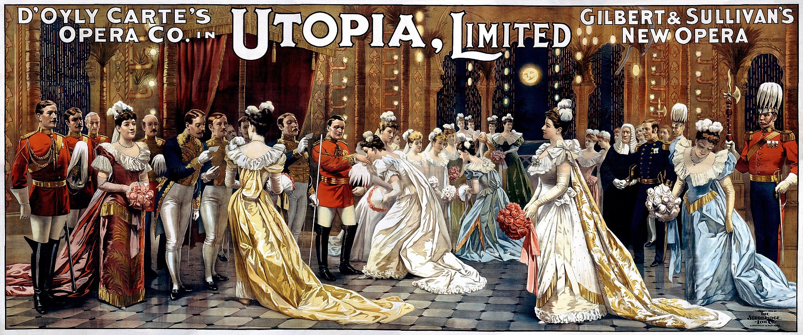

**************************************************
Utopia Limited
**************************************************

Utopia, Limited; or, The Flowers of Progress, is a Savoy opera, with music by Arthur Sullivan and libretto by W. S. Gilbert. It was the second-to-last of Gilbert and Sullivan's fourteen collaborations, premiering on 7 October 1893 for a run of 245 performances. It did not achieve the success of most of their earlier productions.

Gilbert's libretto satirises limited liability companies, and particularly the idea that a bankrupt company could leave creditors unpaid without any liability on the part of its owners. It also lampoons the Joint Stock Company Act by imagining the absurd convergence of natural persons (or sovereign nations) with legal commercial entities under the limited companies laws. In addition, it mocks the conceits of the late 19th-century British Empire and several of the nation's beloved institutions. In mocking the adoption by a "barbaric" country of the cultural values of an "advanced" nation, it takes a tilt at the cultural aspects of imperialism. The libretto was criticised as too long and rambling by some critics and later commentators, and several subplots introduced in Act I are never resolved.

Utopia is performed much less frequently than most other Gilbert and Sullivan operas. It can be expensive to produce, requiring a large principal cast and two costumes ("native" and "drawing room") for most of the performers. The subject-matter and characters, including the specific government offices, are obscure for modern audiences, although its themes of corporatisation of public institutions and scandal in the British Royal family remain relevant. Bernard Shaw wrote in his highly favourable October 1893 review of the show in The World, "I enjoyed the score of Utopia more than that of any of the previous Savoy operas."

