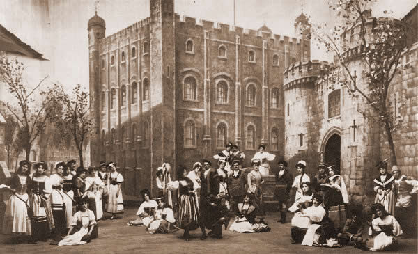

**************************************************
The Yeomen of the Guard
**************************************************

The Yeomen of the Guard (1888), their only joint work with a serious ending, concerns a pair of strolling players—a jester and a singing girl—who are caught up in a risky intrigue at the Tower of London during the 16th century. The dialogue, though in prose, is quasi-early modern English in style, and there is no satire of British institutions. For some of the plot elements, Gilbert had reached back to his 1875 tragedy, Broken Hearts. The Times praised the libretto: "It should... be acknowledged that Mr. Gilbert has earnestly endeavoured to leave familiar grooves and rise to higher things". Although not a grand opera, the new libretto provided Sullivan with the opportunity to write his most ambitious theatre score to date. The critics, who had recently lauded the composer for his successful oratorio, The Golden Legend, considered the score to Yeomen to be Sullivan's finest, including its overture, which was written in sonata form, rather than as a sequential pot-pourri of tunes from the opera, as in most of his other overtures.

