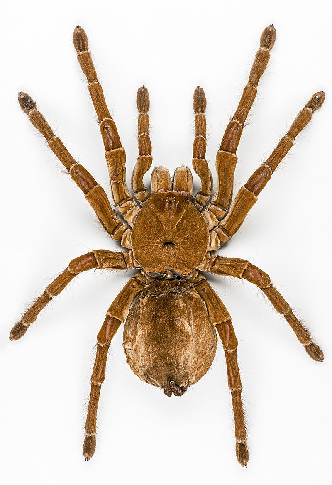

**************************************************
Goliath Birdeater
**************************************************

The Goliath birdeater (Theraphosa blondi) belongs to the tarantula family Theraphosidae. Found in northern South America, it is the largest spider in the world by mass (175 g (6.2 oz)) and body length (up to 13 cm (5.1 in)), and second to the giant huntsman spider by leg span. It is also called the Goliath tarantula or Goliath bird-eating spider; the practice of calling theraphosids "bird-eating" derives from an early 18th-century copper engraving by Maria Sibylla Merian that shows one eating a hummingbird. Despite the spider's name, it rarely preys on birds.

Unlike other species of spider/tarantula, females do not eat the males during mating. Females mature in 3–6 years and have an average lifespan of 15 to 25 years. Males die soon after maturity and have a lifespan of three to six years. Colors range from dark to light brown with faint markings on the legs. Bird-eaters have hair on their bodies, abdomens, and legs. The female lays 100 to 200 eggs, which hatch into spiderling within 6–8 weeks.

