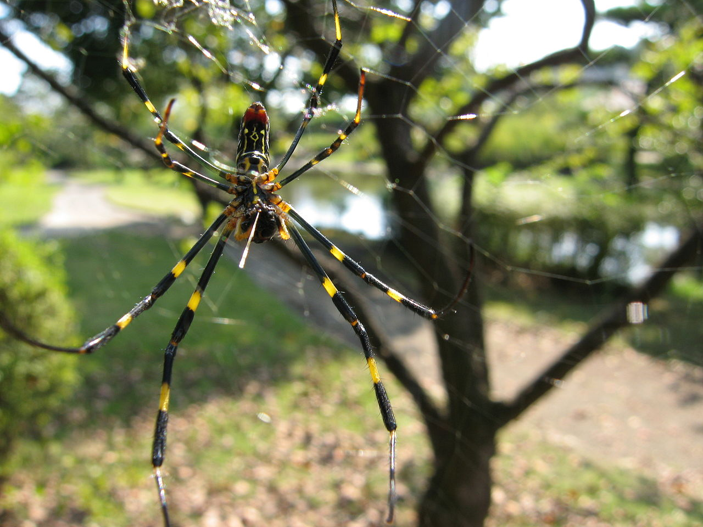

**************************************************
Trichonephila Clavata
**************************************************

The web of females may reach several meters in length. In sunlight, the yellow threads appear to be a rich gold color. The structure of the web seen in cross-section is unusual for an orb web; it has three layers: the central orb, plus two irregular layers in front and behind the orb.

The adult female individual has stripes of yellow and dark blue, with red toward the rear of the abdomen. In autumn, smaller males may be seen in the webs of the females for copulating. After mating, the female spins an egg sack on a tree, laying 400 to 1500 eggs in one sack. Her lifecycle ends by late autumn or early winter with the death of the spider. The next generation emerges in spring.

Although the spider is not aggressive, they will bite to protect themselves. The bite is considered painful, but not life-threatening.

Researchers led by Masao Nakagaki at Shinshu University, Japan, have succeeded in creating a silk thread that is stronger, softer, and more durable than conventional silk by injecting silkworm eggs with genes of the Jorō spider. The silkworms that hatch weave cocoons containing 10% spider protein. The dragline silk is said to have many uses, such as for bulletproof vests, sutures after an operation, fishing line, nets, and tennis rackets. A Japanese manufacturer, Okamoto, began developing commercial applications for the silk and planned to release extra-thin, durable spider socks by 2010.

