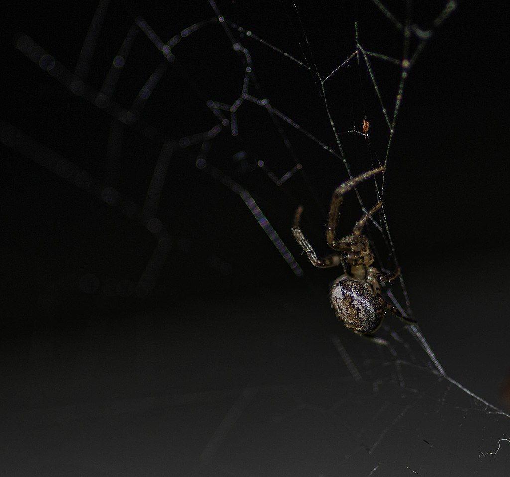

**************************************************
Zygiella X-Notata
**************************************************

Zygiella x-notata, sometimes known as the missing sector orb weaver or the silver-sided sector spider, is a spider species in the family Araneidae. They are solitary spiders, residing in daily-spun orb webs. Z. x-notata is a member of the genus Zygiella, the orb-weaving spiders. The adult female is easily recognized by the characteristic leaf-like mark on her posterior opisthosoma, caudal to the yellow-brown cephalothorax.

The webs of Zygiella x-notata spiders are known for their characteristic missing sector, lending to the common name of spider as the "missing sector orb weaver". This species is distributed widely around the world, primarily inhabiting areas of human occupancy in northern Europe.

Common prey include flying insects and other small insects. These get caught in the sticky spiral hub of the spider's orb web. Capture of prey occurs as the foreleg of Z x-notata detects vibrations on the signal strand that connects the spider's retreat to the prey-capturing hub of the web. Webs are rebuilt daily by juvenile Zygiella x-notata and are renewed as needed by adult females. After sexual maturity, males discontinue web production in search of fecund females. After reproduction during the summer months, males die. Females produce an egg sac in late autumn and juveniles emerge in late spring. After several moults, juvenile females are ready to reproduce.

Zygiella x-notata has an annual life cycle. Female spiders lay eggs in autumn, predominantly during the months of September and October. While males die soon after mating, surviving females protect the egg sacs over winter from Hymenopteran parasites. Egg sacs hatch in spring, and spiderlings subsequently disperse. Spiderlings reach their adult instar in August, when mating begins again, and the cycle starts anew. Once in the adult stage, female Zygiella x-notata has a life span of approximately 5–7 months.

